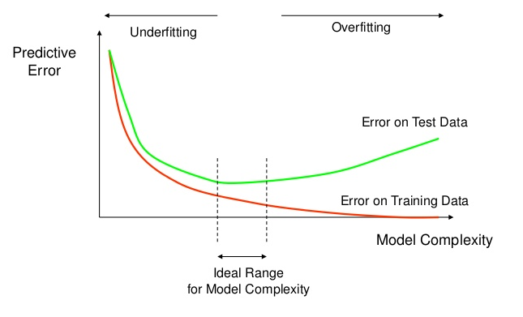

# Autonomous Systems Interview Practice project (Deep Learning Engineer)

### Explain a recent project you've worked on. Why did you choose this project? What difficulties did you run into this project that you did not expect, and how did you solve them?

Last year, I participated in the CVPRW2018 DeepGlobe road extraction challenge. The reason I chose this project is that by this project, I can have hands-on experience about how to do semantic segmentation based on deep learning. One of the difficulties I met is that I got a bottleneck to improve the IoU accuracy of road extraction. No matter how I change the architecture of networks, the accuracy cannot increase. Then, I searched on the website and found that for machine learning challenges, model ensembling is a very efficient technique to improve efficiency. Since every model has its specific advantage for extracting the corresponding features, by ensembling different kinds of models, the benefits of each model can be fused so that the final accuracy can be improved. Moreover, another strategy I adopt is a combination of thinking and experimenting. 

### Given different train/test accuracy curves, describe what is going on and how to address it (overfitting, learning rate too high, etc.)


Usually, the learning curve during training can be illustrated as follows if overfitting happens:



*An illustration of overfitting*

As we can see, the cost function rapidly decreases as the training going on. However, when we test the model on the test dataset, the cost first decreases and then increases at some point. That means the model overfits the training samples too much, and the generalization capability becomes worse. Also, setting the learning rate too high may come across the same situation here. According to my experiment, too high learning rate setting may also make the model cannot learn anything. 

### What is the difference between object classification and detection? How do any related architectures often differ from accomplishing these tasks?

Object classification is an image-level classification task. Specifically, given an image of the object, the output is a label that represents the class of such purpose. However, object detection is a task that the production not only contains the class label of the object but also contains the annotation of the region of such a purpose. Usually, the bounding box represents such a region. The differences in the architectures on those two tasks typically happen in the last several layers. The previous segment of object classification is with the size of the number of classes. The size of the prior layer of object detection architecture contains the size of object classes, the size of detected bounding box coordinates, and also the corresponding confidence scores. 

### How do you deal with severely unbalanced data? In what situations might this occur?

One option is to do data augmentation, especially for those classes with a limited number of samples. Weighted loss can also be considered as an option where the loss of the class with a large number of samples can be set with a small weight and vice versa. Unbalanced data can often occur when the examples of some classes cannot be easily collected comparing to others. 

### How do you reduce overfitting in a neural network? What is regularization, and how does it impact overfitting?

Weight decay is one option, which the loss function also considers to minimize the L2 norm of the weights. It can prevent some of the masses are too large, which overfits the dataset during training. Furthermore, dropout can be another option. Dropout sets the neurons zero with a random fraction, `p.` By doing so, it can decrease the interdependency of the neurons, which can avoid overfitting problem during training. Also, during testing, the evaluation model can be considered as the ensembling of many trained models, so that the generalization capability can be increased. 


### Say you have collected camera data from a mobile robot in which you would like to denote various objects of multiple classes with bounding boxes. How would you go about annotating these objects in your dataset? How would your answer change if instead of bounding boxes, you used semantic segmentation? What about instance segmentation?

For annotating objects for the detection, I would like to use specific software e.g., labeling. For semantic segmentation, since every pixel should be labeled, I can use polygon to extract the object areas. For instance, segmentation, bounding boxes, and semantic regions are both needed for annotation. 


### Say you have collected 3D data from a mobile robot in which you would like to denote various objects of multiple classes with bounding boxes. How would you go about annotating these objects in your dataset?

I have not experienced processing 3D data. 


### Given a dataset of images or 3D data over time, what do you need to consider in creating training and validation data? How would you create your test set to test a related trained network?

Usually, the training and validation data is split with the ratio of 8:2 or 7:3. 

For testing, the test dataset should not be seen by the network before. To test the generalization capability, different situations should be considered during the collection. For example, the training and validation dataset may be collected from one place, while the test dataset can come from a different location. 


### Explain the concepts behind Deep Reinforcement Learning and how you would implement such a technique toward Motion Planning. How would you determine the reward functions to use? Would your implementation generalize well towards new, previously unseen environments?

I did not get in touch with Deep Reinforcement learning before. Could you please suggest some structural materials to read?


### Have you deployed any models you have trained and tested into any production systems, or otherwise used on hardware outside of the same computer you trained the network on, such as an embedded system? What additional steps did you take to implement the model, and what type of testing did you perform to ensure appropriate performance?

I have not deployed one. In my opinion, the first thing is that C++ API or other low-level languages should call the inference model. Also, the efficiency of the codes should be optimized for the production system. 

### [code] Explain a recent in-depth learning research paper you read and how it improved upon existing methods. What were its strengths and weaknesses? Code a mock-up of the network used in this paper in your desired deep learning library.


### [code] Explain the ResNet neural network architecture. What were some of the key insights of this architecture compared to previous approaches, and why do they result in improvements in performance? Code an example of how to use residual layers in your desired deep learning library.


These two questions I can answer together. I read in-depth learning research papers of ResNet recently. Here is the critical point of this architecture. 

From [here](https://github.com/pytorch/vision/blob/master/torchvision/models/resnet.py):
```
class BasicBlock(nn.Module):

    expansion = 1

    def __init__(self, inplanes, planes, stride=1, downsample=None):

        super(BasicBlock, self).__init__()
        self.conv1 = conv3x3(inplanes, planes, stride)
        self.bn1 = nn.BatchNorm2d(planes)
        self.relu = nn.ReLU(inplace=True)
        self.conv2 = conv3x3(planes, planes)
        self.bn2 = nn.BatchNorm2d(planes)
        self.downsample = downsample
        self.stride = stride

    def forward(self, x):

        identity = x

        out = self.conv1(x)
        out = self.bn1(out)
        out = self.relu(out)

        out = self.conv2(out)
        out = self.bn2(out)

        if self.downsample is not None:
            identity = self.downsample(x)

        out += identity
        out = self.relu(out)

        return out


class Bottleneck(nn.Module):

    expansion = 4

    def __init__(self, inplanes, planes, stride=1, downsample=None):

        super(Bottleneck, self).__init__()
        self.conv1 = conv1x1(inplanes, planes)
        self.bn1 = nn.BatchNorm2d(planes)
        self.conv2 = conv3x3(planes, planes, stride)
        self.bn2 = nn.BatchNorm2d(planes)
        self.conv3 = conv1x1(planes, planes * self.expansion)
        self.bn3 = nn.BatchNorm2d(planes * self.expansion)
        self.relu = nn.ReLU(inplace=True)

        self.downsample = downsample
        self.stride = stride

    def forward(self, x):

        identity = x

        out = self.conv1(x)
        out = self.bn1(out)
        out = self.relu(out)

        out = self.conv2(out)
        out = self.bn2(out)
        out = self.relu(out)

        out = self.conv3(out)
        out = self.bn3(out)

        if self.downsample is not None:
            identity = self.downsample(x)

        out += identity
        out = self.relu(out)

        return out

```

The strength of ResNet is that it tries to learn an identical mapping from the input to the output. By doing that, the degradation problem can be solved when the network becomes deeper and deeper. Since nonlinear neural networks can quickly learn an identical mapping, lower level features can be correspondingly propagated to the end.   


### [Code] Explain the GoogLeNet/Inception neural network architecture. What were some of the key insights of this architecture compared to previous approaches, and why do they result in improvements in performance? Code an example of how to use inception layers in your desired deep learning library.

The critical insight of the Inception neural network is that the system determines the optimal solution of kernel size. It tackles the problem that the dimensions of objects in different images are usually various so that the optimal kernel size cannot be easily fixed. Also, stacking large convolutional operations is computationally expensive. By concatenating several outputs from different convolutional activities with various kernel sizes, the network can adaptively choose the proper kernel size during training. 

From [here](https://github.com/pytorch/vision/blob/master/torchvision/models/inception.py):

``` 
class InceptionA(nn.Module):

    def __init__(self, in_channels, pool_features):
        super(InceptionA, self).__init__()
        self.branch1x1 = BasicConv2d(in_channels, 64, kernel_size=1)

        self.branch5x5_1 = BasicConv2d(in_channels, 48, kernel_size=1)
        self.branch5x5_2 = BasicConv2d(48, 64, kernel_size=5, padding=2)

        self.branch3x3dbl_1 = BasicConv2d(in_channels, 64, kernel_size=1)
        self.branch3x3dbl_2 = BasicConv2d(64, 96, kernel_size=3, padding=1)
        self.branch3x3dbl_3 = BasicConv2d(96, 96, kernel_size=3, padding=1)

        self.branch_pool = BasicConv2d(in_channels, pool_features, kernel_size=1)

    def forward(self, x):
        branch1x1 = self.branch1x1(x)

        branch5x5 = self.branch5x5_1(x)
        branch5x5 = self.branch5x5_2(branch5x5)

        branch3x3dbl = self.branch3x3dbl_1(x)
        branch3x3dbl = self.branch3x3dbl_2(branch3x3dbl)
        branch3x3dbl = self.branch3x3dbl_3(branch3x3dbl)

        branch_pool = F.avg_pool2d(x, kernel_size=3, stride=1, padding=1)
        branch_pool = self.branch_pool(branch_pool)

        outputs = [branch1x1, branch5x5, branch3x3dbl, branch_pool]
        return torch.cat(outputs, 1)


```


### [Code] Explain the MobileNet neural network architecture. What were some of the key insights of this architecture compared to previous approaches, and why do they result in improvements in speed performance? Code an example of how to implement MobileNet in your desired deep learning library, and compare it to layers in other neural networks, noting why inference speed is improved.


There are two kinds of MobileNet, V1, and V2. Both of these two versions of MobileNet make use of Depthwise Separable Convolution. It is a depthwise convolution followed by a pointwise convolution, which can heavily reduce the number of parameters for training. For example, with `N` input channels, `M` output channels, spatial size of feature maps is,` and convolutional kernel size `K,` the depthwise separable convolution operation cost is `N*D*D*K*K + M*N*D*D` and the cost of standard convolution operation `D*D*M*N*K*K.` Besides utilizing Depthwise Separable Convolution, MobileNetV2 also proposes a block called inverted residual. Different from residual block utilized in ResNet, which is wide->narrow->wide, inverted residual block adopts narrow->wide->narrow strategy. 

From [here](https://github.com/tonylins/pytorch-mobilenet-v2):


```

class depthwise_separable_conv(nn.Module):
    def __init__(self, nin, nout):
        super(depthwise_separable_conv, self).__init__()
        self.depthwise = nn.Conv2d(nin, nin, kernel_size=3, padding=1, groups=nin)
        self.pointwise = nn.Conv2d(nin, nout, kernel_size=1)

    def forward(self, x):
        out = self.depthwise(x)
        out = self.pointwise(out)
        return out

class InvertedResidual(nn.Module):
    def __init__(self, inp, oup, stride, expand_ratio):
        super(InvertedResidual, self).__init__()
        self.stride = stride
        assert stride in [1, 2]

        hidden_dim = round(inp * expand_ratio)
        self.use_res_connect = self.stride == 1 and inp == oup

        if expand_ratio == 1:
            self.conv = nn.Sequential(
                # dw
                nn.Conv2d(hidden_dim, hidden_dim, 3, stride, 1, groups=hidden_dim, bias=False),
                nn.BatchNorm2d(hidden_dim),
                nn.ReLU6(inplace=True),
                # pw-linear
                nn.Conv2d(hidden_dim, oup, 1, 1, 0, bias=False),
                nn.BatchNorm2d(oup),
            )
        else:
            self.conv = nn.Sequential(
                # pw
                nn.Conv2d(inp, hidden_dim, 1, 1, 0, bias=False),
                nn.BatchNorm2d(hidden_dim),
                nn.ReLU6(inplace=True),
                # dw
                nn.Conv2d(hidden_dim, hidden_dim, 3, stride, 1, groups=hidden_dim, bias=False),
                nn.BatchNorm2d(hidden_dim),
                nn.ReLU6(inplace=True),
                # pw-linear
                nn.Conv2d(hidden_dim, oup, 1, 1, 0, bias=False),
                nn.BatchNorm2d(oup),
            )

    def forward(self, x):
        if self.use_res_connect:
            return x + self.conv(x)
        else:
            return self.conv(x)

```


### Describe behavioral cloning. How would you go about gathering quality data for this?

Behavioral cloning is predicting steering angle from the provided scene images from the view from single or multiple cameras on the car. The gathered data should contain all the possible situations of the driving vehicle that may occur. In those cases, the car can learn how to behave when encountering such situations. 


### What is a dropout, and what is it used for? Let’s say we have a dropout layer with a 50% drop probability. How would you scale the inputs/outputs between train and inference time? What if the drop probability is 75%?

Dropout is the operation that zero sizes the outputs of neurons with a probability of `(1-p)`. It is utilized for the regularization of neural network training to avoid overfitting. If we have a 50% dropout probability during exercise, the outputs are scaled by a factor of 0.5 during inference. Accordingly, for a 75% dropout, the scale is 0.25.


### Explain why a convolutional neural network typically performs better on image-related tasks that a fully-connected network.

On the one hand, fully-connected networks for image-related tasks usually require a large number of parameters for training. On the other hand, there is a lot of redundancy information in images. By weight sharing, convolutional neural networks can efficiently extract features from photographs, and the number of training parameters can be significantly decreased. In turn, the scale of convolutional neural networks can be increased to make the systems deeper. 


### [Code] Why do vanilla convolutional neural networks (just convolutions followed by pooling layers, out into fully-connected segments) often struggle in determining wherein an image an object resides, and how have more modern methods improved in this area?

First, by pooling layers, some location information of objects is lost. Besides, globally transforming all the feature maps into fully-connected segments also destroy the location information in the images. For object detection, one can first generate some region proposals and then use vanilla convolutional neural networks to  


### Explain how backpropagation works.

Backpropagation is the strategy to update the parameters of the networks during training. It makes use of chain rule for calculating derivatives of parameters in each layer, given the ground truth labels. 


### What features in the data did the model think are most important? For any single prediction from a model, how did each feature in the data affect that particular prediction?

Recently I was working on a self-defined project in deep learning, and during working on it, I had a question that how can I determine which feature is important and has more effect? Mainly, For any single prediction from a model, how did each feature in the data affect that particular prediction? I have realized that answering this question is a concept key that is named feature importance. There are multiple ways to measure feature importance. Some approaches answer subtly different versions of the question above. Other approaches have documented shortcomings. Finally, I found a technique that is named permutation importance. It is really amazing solution for answering the above question. Permutation importance uses models differently than anything you've seen so far, and many people find it confusing at first. So we'll start with an example to make it more concrete. Consider data with the following format:


We want to predict a person's height when they become 20 years old, using data that is available at age 10. Our data includes useful features (height at age 10), features with little predictive power (socks owned), as well as some other features we won't focus on in this explanation. Permutation importance is calculated after a model has been fitted. So we won't change the model or change what predictions we'd get for a given value of height, sock-count, etc. Instead we will ask the following question: If I randomly shuffle a single column of the validation data, leaving the target and all other columns in place, how would that affect the accuracy of predictions in that now-shuffled data?


Randomly re-ordering a single column should cause less accurate predictions, since the resulting data no longer corresponds to anything observed in the real world. Model accuracy especially suffers if we shuffle a column that the model relied on heavily for predictions. In this case, shuffling height at age 10 would cause terrible predictions. If we shuffled socks owned instead, the resulting predictions wouldn't suffer nearly as much.

With this insight, the process is as follows:

Get a trained model.
Shuffle the values in a single column, make predictions using the resulting dataset. Use these predictions and the true target values to calculate how much the loss function suffered from shuffling. That performance deterioration measures the importance of the variable you just shuffled.
Return the data to the original order (undoing the shuffle from step 2). Now repeat step 2 with the next column in the dataset, until you have calculated the importance of each column.


